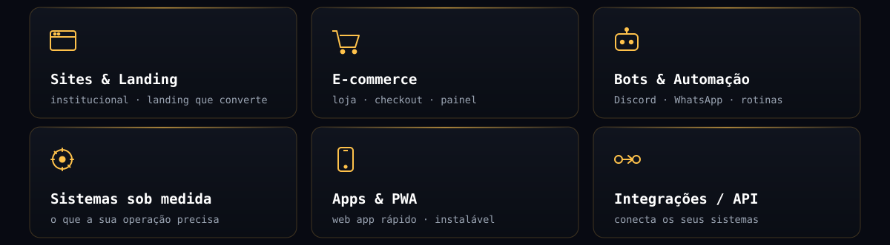
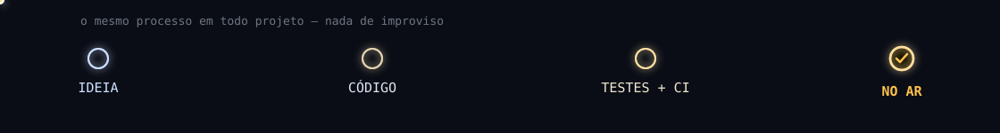

<div align="center">



<!-- a cobrinha percorre as contribuições — atualiza sozinha via GitHub Actions -->
<picture>
  <source media="(prefers-color-scheme: dark)" srcset="https://raw.githubusercontent.com/estevaoradis-pixel/estevaoradis-pixel/output/snake-dark.svg">
  <source media="(prefers-color-scheme: light)" srcset="https://raw.githubusercontent.com/estevaoradis-pixel/estevaoradis-pixel/output/snake.svg">
  
</picture>

</div>

## `01 ·` Quem sou

**Pego a ideia e entrego rodando.**

Desenvolvo software sob medida — do site que vende ao bot que automatiza. Não entrego "funciona na minha máquina": código testado, com CI, feito pra rodar **24/7 sem cair**.

## `02 ·` O que eu faço

<div align="center">



</div>

## `03 ·` Por que comigo

- **Testado de verdade** — testes automatizados + CI. Não quebra quando o cliente usa.
- **Feito pra produção** — roda 24/7, com deploy automático e monitoramento.
- **Do zero ao ar** — código, testes, publicação e o que vier depois: eu cuido de tudo.

## `04 ·` Stack

```text
LINGUAGENS   JavaScript · TypeScript · Python
FRONT-END    React · Next.js · responsivo · PWA
BACK/DADOS   Node · Supabase / Postgres · APIs REST
QUALIDADE    testes automatizados · CI · deploy contínuo
ONDE RODA    Railway · Vercel · 24/7
```

## `05 ·` Como sai do papel

<div align="center">



</div>

## `06 ·` Vamos conversar

Tem uma ideia — ou um problema que dá pra resolver com software? **Chama. Orçamento sem compromisso.**

<div align="center">

[](https://wa.me/5527998843105)

[](mailto:estevao_radis@hotmail.com)

</div>
